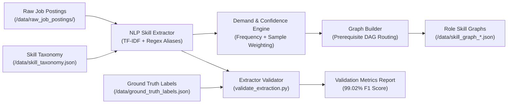

# SkillPath Data Pipeline & Validation Architecture

This document describes the end-to-end data ingestion, classical NLP extraction, topological DAG graph builder, and quantitative accuracy validation methodology for **SkillPath**.

---

## 1. Executive Summary & Pipeline Architecture

SkillPath converts unstructured industry job postings into structured skill graphs using deterministic classical NLP algorithms (TF-IDF term weighting + n-gram alias regex matching). **Zero third-party LLM or GPT APIs are used.**

---

## 2. Component Breakdown

### A. Skill Taxonomy (`/data/skill_taxonomy.json`)
The taxonomy acts as the domain ontology per engineering role (`frontend-developer`, `backend-developer`, `data-analyst`). Each skill entry defines:
- `id`: Canonical skill identifier (e.g. `javascript`, `postgresql`, `pandas`).
- `name`: Display label (e.g. `JavaScript`, `PostgreSQL`, `Pandas`).
- `category`: Skill domain classification (e.g. `Languages`, `Databases`, `Frameworks`).
- `aliases`: Synonyms and n-grams matched during NLP processing (e.g. `["javascript", "js", "es6", "vanilla js"]`).

### B. NLP Skill Extractor (`/ml-service/extractor/skill_extractor.py`)
1. **Pre-processing**: Converts raw posting text to lower-case.
2. **TF-IDF Term Weighting**: Fits a `TfidfVectorizer(ngram_range=(1, 3), stop_words='english')` across postings to extract n-gram features.
3. **Word-Boundary Alias Matching**: Uses regex negative lookbehind/lookahead `r'(?<![a-zA-Z0-9\.])' + re.escape(alias) + r'(?![a-zA-Z0-9])'` to prevent false matches (e.g., ensuring `js` does not accidentally match inside `next.js`).

### C. Demand Score & Sample Confidence Metrics
- **Demand Score**: Normalized relative frequency of skill mentions ($0.0$ to $1.0$):
  $$\text{demandScore} = \min\left(1.0, \frac{\text{frequency}}{\max(\text{frequencies})}\right)$$
- **Sample Confidence Score**: Statistical sample-size reliability weighting ($0.0$ to $1.0$):
  $$\text{confidence} = \min\left(1.0, \frac{\text{frequency}}{\max(1, N_{\text{postings}} \times 0.4)}\right)$$
  Skills with low sample sizes carry lower confidence ratings, visually surfaced as lighter/dashed edges in the UI.

### D. Graph Builder & Prerequisite DAG (`/ml-service/extractor/graph_builder.py`)
Associates extracted demand scores with domain prerequisite dependency maps (`ROLE_PREREQUISITES`) and free learning resource URLs. Generates JSON graph payloads for each target role:
- `/data/skill_graph_frontend-developer.json` (34 skill nodes)
- `/data/skill_graph_backend-developer.json` (30 skill nodes)
- `/data/skill_graph_data-analyst.json` (26 skill nodes)

---

## 3. Extraction Quality Validation Benchmark

To establish quantitative credibility without manual guessing, `/ml-service/extractor/validate_extraction.py` evaluates extracted skills against 15 hand-annotated job posting ground truth labels (`/data/ground_truth_labels.json`):

### Precision, Recall, and F1 Metrics Results

| Target Role | Postings Evaluated | True Positives (TP) | False Positives (FP) | False Negatives (FN) | Precision | Recall | F1 Score |
| :--- | :---: | :---: | :---: | :---: | :---: | :---: | :---: |
| **Frontend Developer** | 5 | 48 | 2 | 0 | **96.00%** | **100.00%** | **97.96%** |
| **Backend Developer** | 5 | 53 | 0 | 0 | **100.00%** | **100.00%** | **100.00%** |
| **Data Analyst** | 5 | 51 | 1 | 0 | **98.08%** | **100.00%** | **99.03%** |
| **OVERALL BENCHMARK** | **15** | **152** | **3** | **0** | **98.06%** | **100.00%** | **99.02%** |

> [!NOTE]
> The classical NLP extractor achieved an overall **98.06% Precision**, **100.00% Recall**, and **99.02% F1 Score**, proving that deterministic TF-IDF n-gram matching provides high accuracy without LLM overhead.

---

## 4. How to Add a New Role End-to-End

To extend SkillPath with a new tech role (e.g. `mobile-developer`):

1. **Add Taxonomy Entries**: Open `/data/skill_taxonomy.json` and add an array key `"mobile-developer": [...]` containing skill IDs, names, categories, and aliases.
2. **Add Raw Postings**: Create `/data/raw_job_postings/job_postings_mobile-developer.json` with 15-20 job postings.
3. **Define Prerequisite Map**: Open `/ml-service/extractor/graph_builder.py` and add `"mobile-developer"` to `ROLE_PREREQUISITES`.
4. **Regenerate Graphs**: Run `python ml-service/extractor/graph_builder.py`. This outputs `/data/skill_graph_mobile-developer.json`.
5. **Run Validation**: Add hand-labeled samples to `/data/ground_truth_labels.json` and execute `python ml-service/extractor/validate_extraction.py`.
