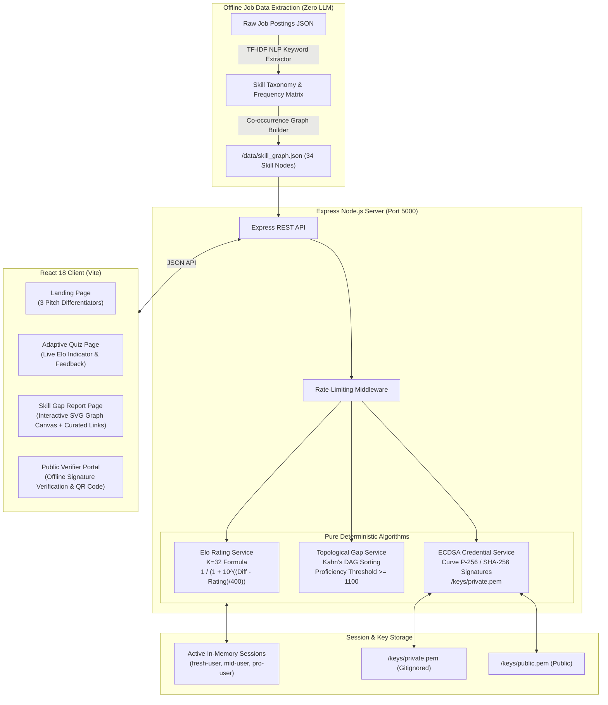

# SkillPath Architecture Diagram

Below is the clean visual Mermaid diagram representing the complete SkillPath platform architecture across data extraction, backend services, cryptographic credentialing, and frontend presentation.

## System Component Breakdown

1. **Job Data Ingestion Pipeline**: Deterministic TF-IDF NLP keyword extraction parses raw hiring data into a skill DAG without LLM dependencies.
2. **Adaptive Assessment Engine**: Calculates Elo rating updates ($K=32$) per skill node in real-time.
3. **Topological Gap Service**: Sorts unproven skills using Kahn's DAG algorithm so prerequisites precede dependent nodes.
4. **ECDSA Cryptographic Credential Signer**: Generates secp256r1 (P-256) SHA-256 digital signatures over canonical JSON payloads. Verified using `/keys/public.pem`.
5. **React Frontend SPA**: Provides visual graph canvas rendering, live Elo movement feedback, and public offline credential verification.
