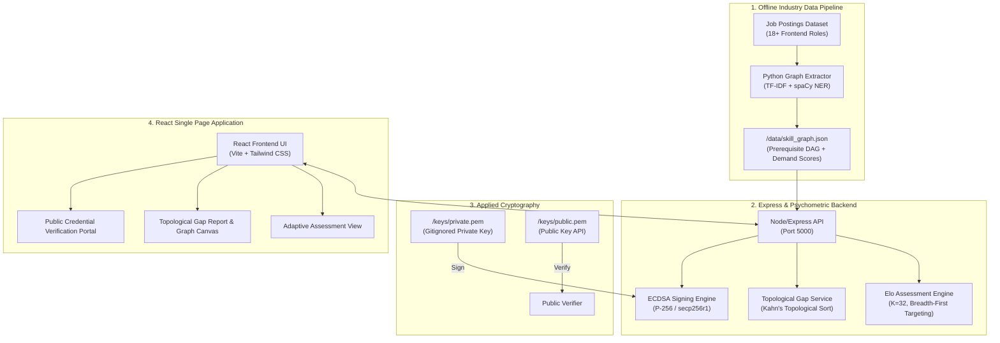
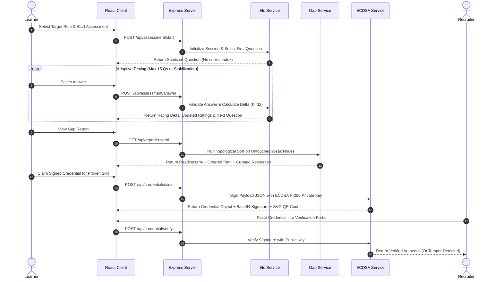

# SkillPath System Architecture Diagram

This document contains visual Mermaid diagrams and component descriptions for the SkillPath platform architecture.

## High-Level Architecture Flowchart

```mermaid
flowchart TD
    subgraph Data Layer ["1. Offline Industry Data Pipeline"]
        JP["Job Postings Dataset\n(18+ Frontend Roles)"] --> SP["Python Graph Extractor\n(TF-IDF + spaCy NER)"]
        SP --> SG["/data/skill_graph.json\n(Prerequisite DAG + Demand Scores)"]
    end

    subgraph Backend Layer ["2. Express & Psychometric Backend"]
        SG --> API["Node/Express API\n(Port 5000)"]
        
        API --> ELO["Elo Assessment Engine\n(K=32, Breadth-First Targeting)"]
        API --> GAP["Topological Gap Service\n(Kahn's Topological Sort)"]
        API --> ECDSA["ECDSA Signing Engine\n(P-256 / secp256r1)"]
    end

    subgraph Security ["3. Applied Cryptography"]
        PRIV["/keys/private.pem\n(Gitignored Private Key)"] -->|Sign| ECDSA
        PUB["/keys/public.pem\n(Public Key API)"] -->|Verify| VERIFY["Public Verifier"]
    end

    subgraph Frontend Layer ["4. React Single Page Application"]
        UI["React Frontend UI\n(Vite + Tailwind CSS)"] <--> API
        UI --> COMP1["Adaptive Assessment View"]
        UI --> COMP2["Topological Gap Report & Graph Canvas"]
        UI --> COMP3["Public Credential Verification Portal"]
    end
```

## Detailed Data & Execution Sequence

```mermaid
sequenceDiagram
    autonumber
    actor Learner
    participant UI as React Client
    participant Server as Express Server
    participant Elo as Elo Service
    participant Gap as Gap Service
    participant ECDSA as ECDSA Service
    actor Recruiter

    Learner->>UI: Select Target Role & Start Assessment
    UI->>Server: POST /api/assessment/start
    Server->>Elo: Initialize Session & Select First Question
    Elo-->>UI: Return Sanitized Question (No correctIndex)

    loop Adaptive Testing (Max 15 Qs or Stabilization)
        Learner->>UI: Select Answer
        UI->>Server: POST /api/assessment/answer
        Server->>Elo: Validate Answer & Calculate Delta (K=32)
        Elo-->>UI: Return Rating Delta, Updated Ratings & Next Question
    end

    Learner->>UI: View Gap Report
    UI->>Server: GET /api/report/:userId
    Server->>Gap: Run Topological Sort on Untouched/Weak Nodes
    Gap-->>UI: Return Readiness % + Ordered Path + Curated Resources

    Learner->>UI: Claim Signed Credential for Proven Skill
    UI->>Server: POST /api/credential/issue
    Server->>ECDSA: Sign Payload JSON with ECDSA P-256 Private Key
    ECDSA-->>UI: Return Credential Object + Base64 Signature + SVG QR Code

    Recruiter->>UI: Paste Credential into Verification Portal
    UI->>Server: POST /api/credential/verify
    Server->>ECDSA: Verify Signature with Public Key
    ECDSA-->>Recruiter: Return Verified Authentic (Or Tamper Detected)
```

## Summary of Architecture Modules

1. **Job Data Taxonomy (`/data/skill_graph.json`)**: Pre-computed offline graph generated from job posting analysis, establishing demand scores and prerequisite relationships across 34 web dev skill nodes.
2. **Adaptive Elo Engine (`/server/src/services/eloService.js`)**: Deterministic psychometric scoring engine ($K=32$) adjusting skill ratings per question answer and targeting unasked questions using breadth-first traversal across untouched nodes.
3. **Topological Gap Analysis (`/server/src/services/gapService.js`)**: Orders skill gaps by prerequisite structure so learners always resolve foundational skills (e.g. `html` $\rightarrow$ `javascript`) before dependent frameworks (e.g. `react`).
4. **ECDSA P-256 Credential Signing (`/server/src/services/credentialService.js`)**: Cryptographically signs credentials using SHA-256 + P-256 ECDSA key pairs, allowing third-party recruiters to verify authenticity offline without server DB lookup.
